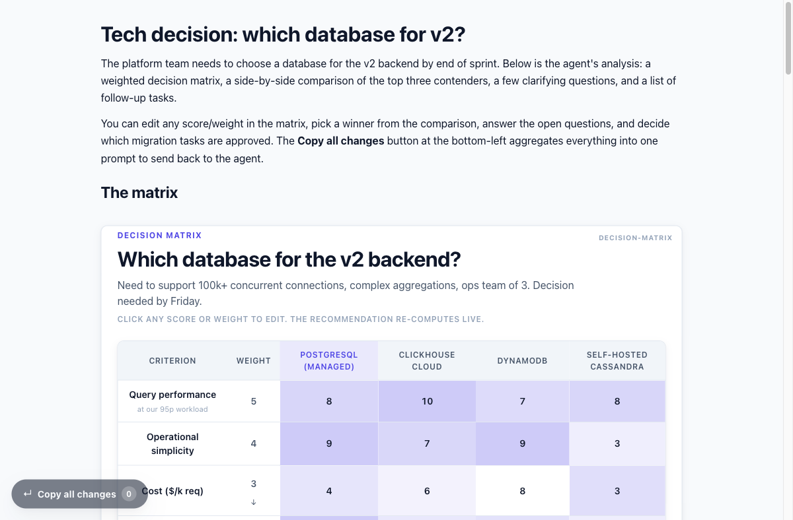
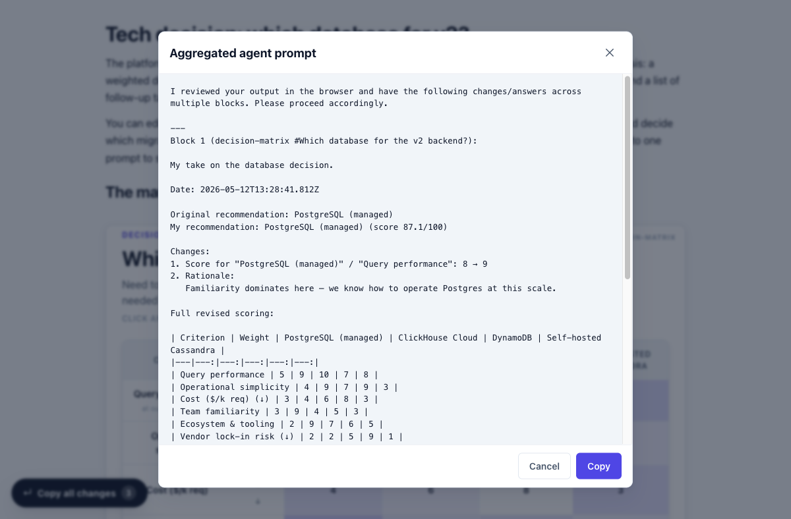
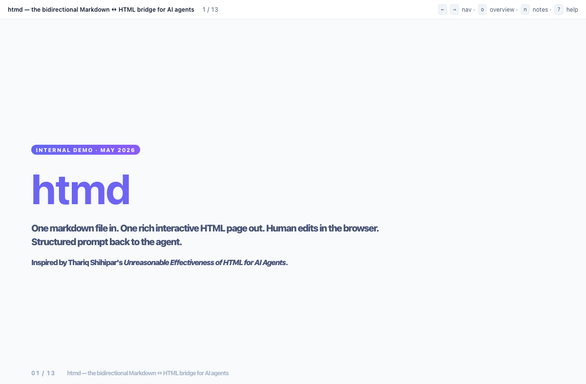
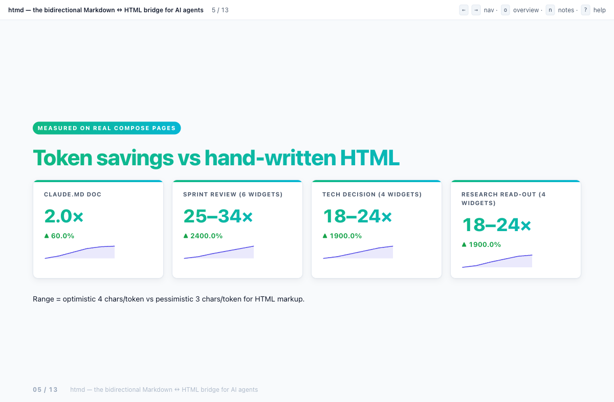
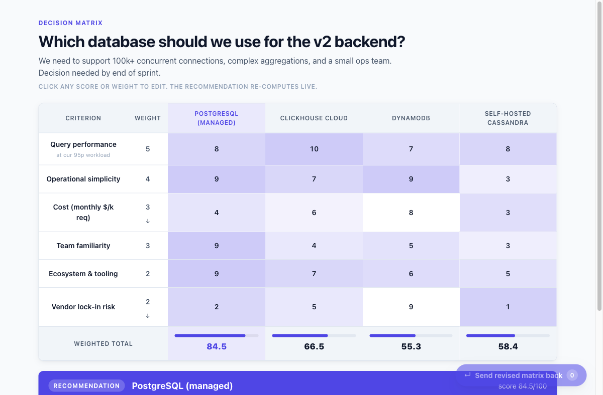
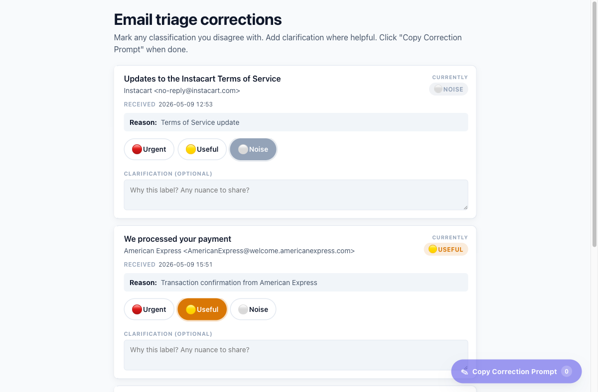
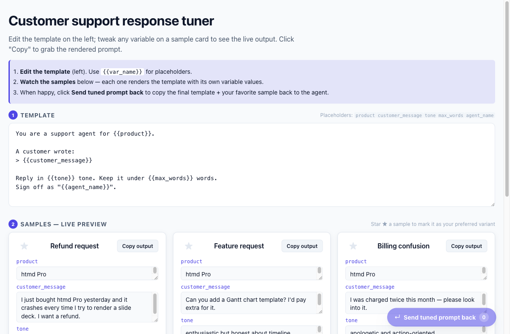
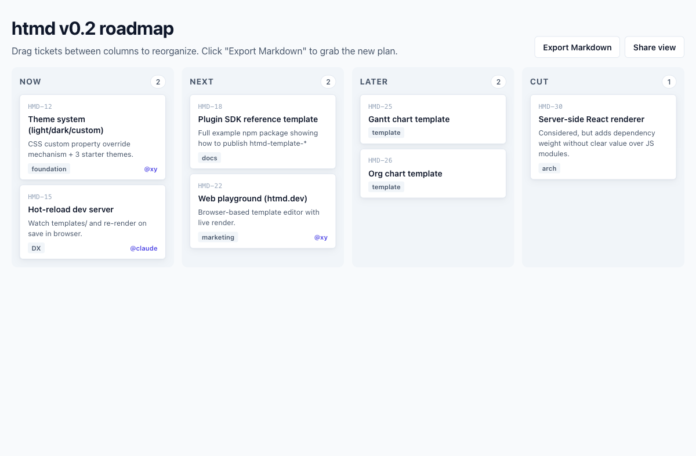
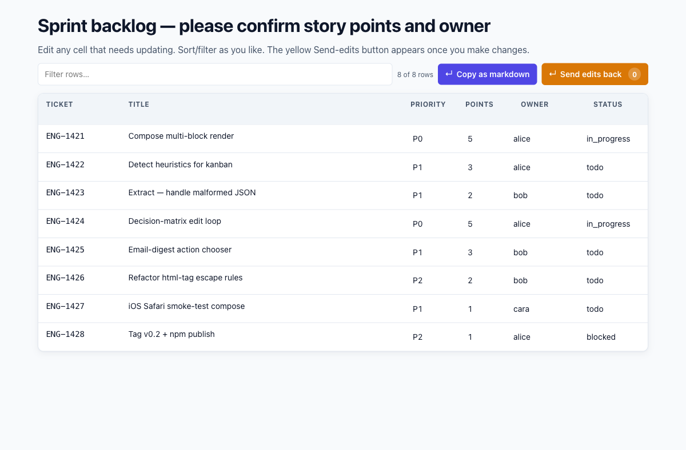
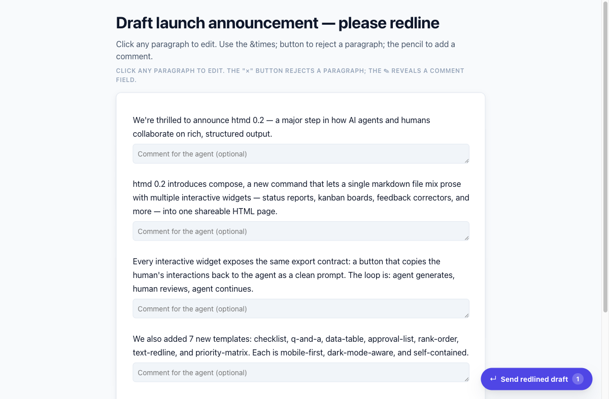

# htmd

> **Markdown ↔ HTML bridge for AI agents and the humans who review them.**
> Agents speak Markdown. Humans want HTML. htmd is the bridge — and the export button on the other side that closes the loop.



*One markdown file. Multiple interactive widgets. One page. One **Copy all changes** button that aggregates every human edit into a single prompt to send back to the agent.*

---

## The thesis in one paragraph

An AI agent writing **Markdown** is cheap but flat. Writing **HTML** directly is ~2.5× the tokens and the agent will skip dark mode, accessibility, drag-drop, print stylesheets — every bit of polish. **htmd** lets the agent emit ~150 tokens of YAML inside Markdown fences and produces a polished, interactive HTML page. More importantly, every interactive widget includes a button that turns whatever the human did in the browser into a structured prompt the agent can pick up next turn.

> *"Diffs and call-graphs are spatial information; markdown flattens them. You stay in the loop; the loop gets tighter."* — [Thariq Shihipar, *The Unreasonable Effectiveness of HTML for AI Agents*](https://thariqs.github.io/html-effectiveness/)

---

## What you get

### A markdown file in. A rich interactive HTML page out.

Authoring a multi-widget review is now this short:

````markdown
# Tech decision: which database for v2?

The platform team needs to choose by Friday. Here is the analysis.

```htmd:decision-matrix
question: Which database for the v2 backend?
criteria:
  - { name: Query performance, weight: 5 }
  - { name: Operational simplicity, weight: 4 }
  - { name: Cost, weight: 3, direction: lower_better }
options:
  - { name: Postgres,    scores: { Query performance: 8,  Operational simplicity: 9, Cost: 4 } }
  - { name: ClickHouse,  scores: { Query performance: 10, Operational simplicity: 7, Cost: 6 } }
```

And a few PRs to clear:

```htmd:approval-list
title: PRs awaiting your review
items:
  - { id: pr1421, title: "feat: compose command", suggested: approve }
  - { id: pr1404, title: "feat: detect (DRAFT)",  suggested: hold }
```
````

```bash
htmd compose decision.md --out decision.html
```

What the human gets: a polished page with a **live editable** decision matrix, a row of PR cards with approve/reject/hold buttons, and one **Copy all changes** button that bundles every edit into a structured prompt.

### Closing the loop — the agent gets back a clean prompt, not a screenshot



*Every interactive widget on the page registers into a global `window.__htmd.blocks` registry. The Copy-all-changes button walks the registry, asks each block for its prompt fragment, and concatenates them with `--- Block N (template):` separators. The human pastes it back to the agent. The agent already knows the shape.*

### Token receipts (measured)

| Scenario | Agent emits | htmd produces | If the agent had hand-written it |
|---|---:|---:|---:|
| CLAUDE.md → `md2html` (read-only doc) | ~1,600 tok | ~3,100–4,200 tok | ~**2× cheaper** with htmd |
| Sprint review compose (6 widgets) | ~1,150 tok | ~29,200–38,900 tok | ~**25–34× cheaper** |
| Tech-decision compose (4 widgets) | ~1,500 tok | ~26,500–35,300 tok | ~**18–24× cheaper** |
| Research read-out compose (4 widgets) | ~1,200 tok | ~21,800–29,000 tok | ~**18–24× cheaper** |
| Slide deck (single template) | ~1,400 tok | ~10,800–14,400 tok | ~**7.7× cheaper** |

Range = optimistic 4 chars/token vs pessimistic 3 chars/token for HTML markup. **And** the agent would skip the polish (dark mode, print, drag-drop, accessibility) entirely if writing by hand. htmd is cheaper *and* qualitatively better.

---

## What it looks like

A slide deck, rendered from 100 lines of YAML:





*9 slide layouts (title / section / bullets / two-col / kpis / quote / image / code / chart) selectable per slide, plus 6 deck themes (indigo / purple / green / warn / ink / slate). Arrow-key navigation, overview grid (`o`), speaker notes panel (`n`), printable one-slide-per-page (`p`).*

An editable **decision matrix** — change any score or weight, watch the recommendation re-compute live:



A **feedback corrector** — the original inspiration for htmd. Mobile-first, pill labels, clarification notes, a copy-ready correction prompt:



A **prompt tuner** — edit the template up top, three sample variant cards render live below, star one as preferred:



A **kanban board** with native drag-and-drop (touch + mouse + iOS Safari), URL-hash sharable state, and Markdown export:



An **editable data table** — sortable, filterable, cells become inputs when `editable: true`, export emits both a markdown table *and* a structured "was → now" change list:



A **text redliner** — click any paragraph to edit, the × button rejects a paragraph entirely, every change shows up in the exported change log:



---

## The 19 templates

The 14 marked **↔** are bidirectional — they include a Copy-back button that emits a structured prompt the agent can ingest.

| Template | What it does |
|---|---|
| `status-report` | Weekly status with shipped / in-progress / blocked sections + optional KPI strip. |
| `dashboard` | KPI grid with big-number cards, sparklines, deltas, targets. |
| `decision-matrix` **↔** | Weighted scoring with heatmap cells. Edit any score or weight; the recommendation re-computes live. |
| `comparison-3-up` **↔** | 2–4 way side-by-side: pros / cons / verdict, plus radio-pick a winner. |
| `email-digest` **↔** | Categorised inbox digest with per-item Reply / Archive / Keep / Forward action chooser. |
| `slide-deck` | 9 layouts, 6 themes, keyboard nav, overview, speaker notes, print-per-page. |
| `prompt-tuner` **↔** | Edit a prompt template, see live previews across N sample variants, star one as preferred. |
| `kanban-board` **↔** | Drag-and-drop board with URL-hash state and Markdown export. |
| `concept-explainer` | Doc with collapsibles, code-sample tabs, hover-glossary tooltips. |
| `feedback-corrector` **↔** | Mobile-first classification corrector with pill labels and copy-ready correction prompt. |
| `checklist` **↔** | Task list with check-offs, notes, owner/priority pills, copy-as-prompt. |
| `q-and-a` **↔** | Clarifying questions (free / single / multi choice); copy answers as prompt. |
| `data-table` **↔** | Sortable, filterable table. With `editable: true`, every cell becomes an input + diff export. |
| `approval-list` **↔** | Approve / reject / hold per item with optional reason. |
| `rank-order` **↔** | Drag-to-rank a list of items; copy the ranked order. |
| `text-redline` **↔** | Inline-edit a draft paragraph by paragraph; reject paragraphs; copy redlined draft + change log. |
| `priority-matrix` **↔** | 4-quadrant drag-drop (Eisenhower by default); copy placements. |
| `chart-block` | Single inline-SVG chart (line/bar/donut/sparkline) with caption + optional data table. |
| `code-review` **↔** | Annotated diff (add/del/context). Click any line number to leave a comment; export all comments. |

Every example is checked in. Browse [`examples/`](./examples/) and open any HTML file directly in a browser. The four compose demos showcase multi-widget pages:

- [`compose-sprint-review.html`](./examples/compose-sprint-review.html) — status + approvals + Q&A + checklist + corrections + priority matrix ([source](./examples/data/compose-sprint-review.md))
- [`compose-tech-decision.html`](./examples/compose-tech-decision.html) — decision matrix + comparison + Q&A + approvals ([source](./examples/data/compose-tech-decision.md))
- [`compose-research-readout.html`](./examples/compose-research-readout.html) — editable data table + chart + redline + checklist ([source](./examples/data/compose-research-readout.md))
- [`compose-friday-triage.html`](./examples/compose-friday-triage.html) — inbox digest + classifier corrections + approvals + Q&A ([source](./examples/data/compose-friday-triage.md))

---

## Quick start

```bash
npm install -g htmd

# The headline command — compose a multi-widget page
htmd compose review.md --out review.html

# Same, but publish to the local serve dir + print the public URL (Phase 1)
htmd compose review.md --serve

# Single template render
htmd render decision-matrix --data db.yaml --out decision.html

# Suggest which templates fit a plain markdown file
htmd detect notes.md --json

# Recover state from an interacted-with HTML file (closes the loop)
htmd extract review.html

# Discovery
htmd templates              # list all templates
htmd schema decision-matrix # get JSON schema for one

# Serve rendered pages over HTTP so they open in mobile browsers, with a
# "Send to agent" button that POSTs the assembled prompt back without copy-paste
htmd serve                  # default: 0.0.0.0:8787, dryrun submit mode
```

Programmatic:

```js
import { renderTemplate, composeFromMarkdown, detectTemplates, extractState } from 'htmd';
const { html, errors, blocks } = await composeFromMarkdown(myMarkdown);
```

---

## How agents actually call it

htmd is a **Node CLI**, invoked via the shell. Claude (or any agent) reads [`SKILL.md`](./SKILL.md) once at session start — that's the decision tree teaching it when to reach for `compose` vs `render` vs `detect` vs `extract`. Then for every concrete task it calls the CLI through its Bash tool.

The agent never writes HTML. The agent writes YAML, runs `htmd compose file.md`, and tells the human:

> *I generated `/tmp/review.html`. Open it in a browser, make any corrections, then click **Copy all changes** at the bottom-left and paste the result back to me.*

The human edits in the browser. Clicks the button. Pastes back a clean structured prompt. The agent picks up where it left off. **You stay in the loop; the loop gets tighter.**

See [`docs/AGENT_USAGE.md`](./docs/AGENT_USAGE.md) for the long-form workflow and [`CLAUDE.md`](./CLAUDE.md) for the architecture.

---

## Authoring a new template

Every template lives in `templates/<name>/` with five files (six if interactive):

```
my-template/
├── render.js       # default export: render(data, helpers) → string
├── schema.json     # JSON Schema for input validation
├── style.css       # uses CSS custom properties from _base/tokens.css
├── description.md  # one-line summary surfaced in `htmd templates`
├── example.yaml    # sample input — also what `htmd render <t>` falls back to
└── script.js       # OPTIONAL — for interactive templates
```

Interactive templates register their export contract into a shared registry so `htmd compose` can aggregate them:

```js
window.__htmd = window.__htmd || { blocks: [] };
window.__htmd.blocks.push({
  template: 'my-template',
  blockId: state.title,
  hasChanges: () => /* boolean */,
  getPrompt: () => /* the prompt string sent back to the agent */
});
```

Scaffold one with `htmd init-template my-template`. Full guide: [`docs/TEMPLATE_AUTHORING.md`](./docs/TEMPLATE_AUTHORING.md).

### Plugin SDK

Publish a template as `htmd-template-<name>` on npm with `"htmd-template"` in `keywords`. htmd auto-discovers it from `node_modules/`.

---

## What's in this repo

- **17 KB** of orchestration code (`src/`): compose, detect, extract, render, schema, html-tag, charts, **serve** (Phase 1).
- **19 templates** (`templates/`) — each self-contained.
- **86 tests** (`tests/`) — vitest. `npm test`. Covers compose parsing, schema validation, every template rendering its example, the export-protocol convention, MD↔HTML round-trip, extract recovery, **serve + submit-pipeline (dryrun + file modes)**.
- **23 rendered HTML examples** (`examples/`) including the 4 compose demos and the new `compose-serve-demo.md`.

Zero runtime build step. Node 20+, ESM only. Output is one self-contained HTML file — no CDNs, works offline, can be emailed. **New in v0.3.0:** `htmd serve` + `htmd compose --serve` add an optional round-trip channel (host the page at a URL, accept submit POSTs back to the agent). See [`docs/SERVE.md`](docs/SERVE.md).

---

## Serving rendered htmd pages (v0.3.0)

The output of `htmd compose` is great for desktop and email, but Telegram document attachments are awkward on iPhone — iOS treats `.html` files as downloads, the in-app preview is read-only, JS coverage is spotty, and clipboard-from-`file://` is unreliable.

`htmd v0.3.0` adds an optional serve layer that keeps htmd's "self-contained HTML" guarantee but lets the page be reached at a stable URL on a private network (Tailscale, LAN, or via SSH tunnel), AND lets the in-page FAB POST changes directly back to the agent instead of forcing copy-paste.

```bash
# 1. Start the server (built-in node http; no Express; no daemons)
htmd serve

# 2. Render with --serve flag in another shell
htmd compose review.md --serve
# → http://100.70.189.117:8787/r/review-a1b2c3d4

# 3. Open the URL on your phone, fiddle with the widgets, tap
#    "Send all changes" — the modal previews the prompt, hit Send,
#    and the assembled prompt is routed back to your OpenClaw agent.
```

The submit endpoint supports four delivery modes (`HTMD_SUBMIT_MODE`):
`dryrun` (default, logs only), `file` (writes to `~/.htmd/inbox/`), `telegram`
(direct Bot API POST), and `openclaw-ssh` (real agent turn via SSH to the
OpenClaw host). Full operational guide in **[`docs/SERVE.md`](docs/SERVE.md)**.

The "Send to agent" button is a **strict addition** — pages rendered without
`--serve` still get the old "Copy all changes" FAB and behave identically to
v0.2.

---

---

## Architecture (one paragraph)

CLI in `bin/htmd.js` → `src/cli.js` (commander). Templates load on demand. Render path: `loadTemplate(name)` → ajv-validate against `schema.json` → call `render(data, helpers)` (a tagged template literal `html\`\`` that auto-escapes) → wrap in shell that inlines `tokens.css` + `reset.css` + template CSS + optional template JS. `compose.js` walks `marked.lexer`, splits prose vs. ` ```htmd:* ` fences, renders each block, dedupes CSS/JS, injects the global Copy-all-changes FAB and bridge JS. `detect.js` runs per-template heuristic detectors and returns ranked suggestions. `extract.js` parses `<script type="application/json" data-htmd-state>` blocks back into YAML. Charts are inline SVG via `src/chart.js` (zero deps). Plugins are auto-discovered npm packages named `htmd-template-*`.

---

## Inspiration

- [Thariq Shihipar — *The Unreasonable Effectiveness of HTML for AI Agents*](https://thariqs.github.io/html-effectiveness/) — the thesis: HTML is what humans want to consume; every artifact should end with an export button.
- The original `feedback-corrector` template — the canonical "human-in-the-loop returns a prompt to the agent" pattern that the other 13 bidirectional templates are modeled on.

---

## License

MIT. See [`LICENSE`](./LICENSE).
